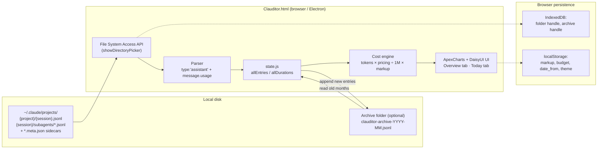
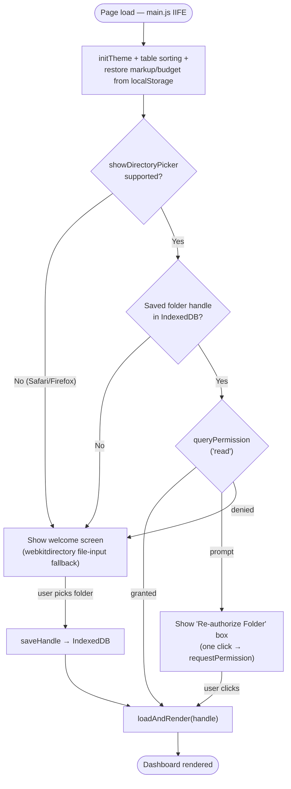
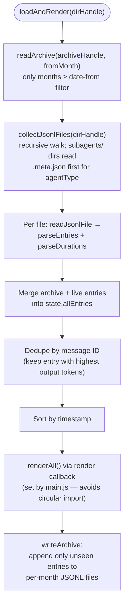
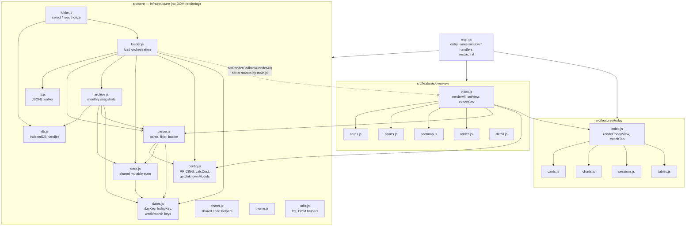
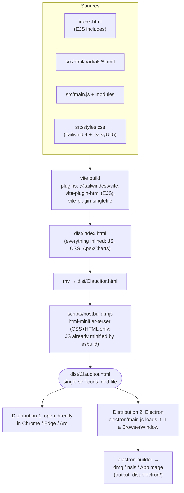

# Clauditor — Architecture & Flow Diagrams

> Companion to [CLAUDE.md](CLAUDE.md) and [README.md](README.md). All diagrams are Mermaid — GitHub renders them natively.

## 1. Big picture — what the app does

Clauditor is a **single-file HTML dashboard** that reads Claude Code's local session logs, computes token costs from Anthropic pricing, and renders charts. Everything runs in the browser; no server, no uploads.

Key facts:

- Only JSONL lines with `type: "assistant"` and a `message.usage` field are counted ([parser.js](src/core/parser.js)).
- Cost is always recomputed from token counts × the pricing table in [config.js](src/core/config.js) — the `costUSD` field in the logs is never trusted. Matching is longest-pattern-first; models with no entry trigger a visible warning banner (they'd otherwise be silently priced at default rates).
- An optional markup multiplier (default **×1** — no markup) can be applied on top of the Anthropic base cost.
- All day/week/month bucketing happens in the **viewer's local timezone** via [dates.js](src/core/dates.js) — timestamps are UTC instants, and `date` is recomputed from `ts` at parse and archive-read time, so data recorded in any timezone displays consistently.
- Subagent JSONL files get an `agentType` label resolved from `.meta.json` sidecars, powering the per-session agent breakdown.

## 2. Startup & folder authorization flow

## 3. Data-loading pipeline (`loadAndRender`)

Why the dedupe matters: streaming responses write multiple partial `assistant` entries with the same message ID; keeping the max-output one prevents double counting. The identity key lives in exactly one place — `entryKey()` / `durationKey()` in [parser.js](src/core/parser.js) — and is shared by the loader dedupe, the archive's append-only writes, and the archive merge, so the three can never drift apart.

## 4. Module dependency graph

Two intentional patterns to preserve:

1. **`core/` never imports from `features/`.** The one place it needs to trigger rendering, [loader.js](src/core/loader.js) uses a callback injected by [main.js](src/main.js) (`setRenderCallback`).
2. **`window.*` exposure.** The bundle is an ES module, so any function referenced by an HTML `onclick="..."` attribute must be added to the `Object.assign(window, {...})` block at the bottom of [main.js](src/main.js). Forgetting this is the most common way to break a new button.

## 5. Build & distribution pipeline

## 6. Where things persist

| What | Where | Key |
|---|---|---|
| Selected `.claude/projects` folder | IndexedDB `clauditor/handles` | `root` |
| Archive folder | IndexedDB `clauditor/handles` | `archiveHandle` |
| Markup multiplier | localStorage | `clauditor_markup` |
| Monthly budget | localStorage | `clauditor_budget` |
| Date-from filter | localStorage | `clauditor_date_from` |
| Dismissed banners (1-month expiry per item) | localStorage | `clauditor_dismissals` |
| Theme (winter/dracula) | localStorage | `clauditor_theme` |
| Historical usage data | Archive folder on disk | `clauditor-archive-YYYY-MM.jsonl` |
