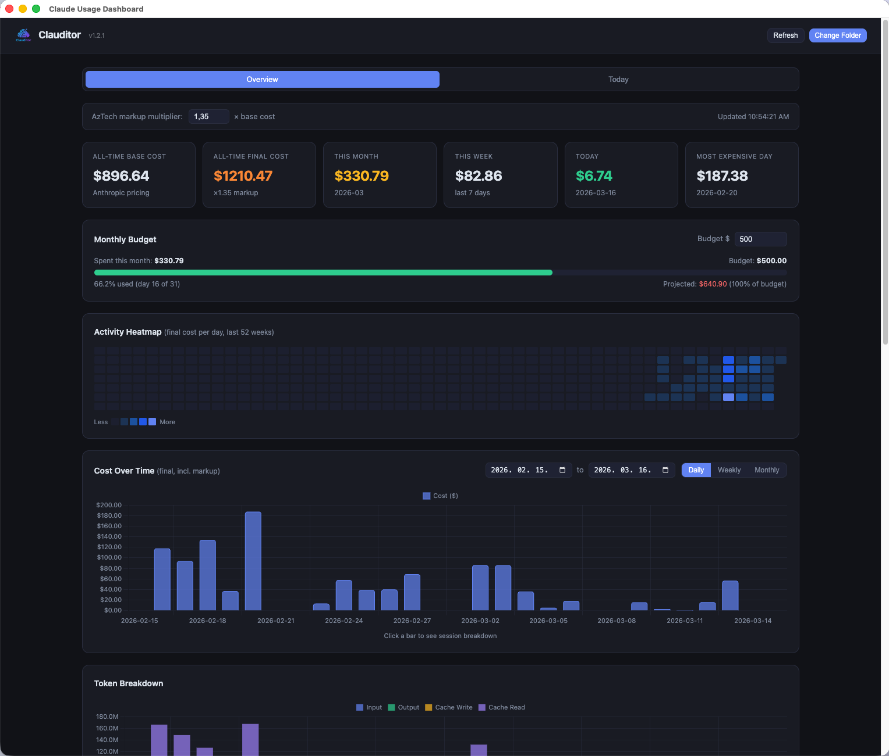
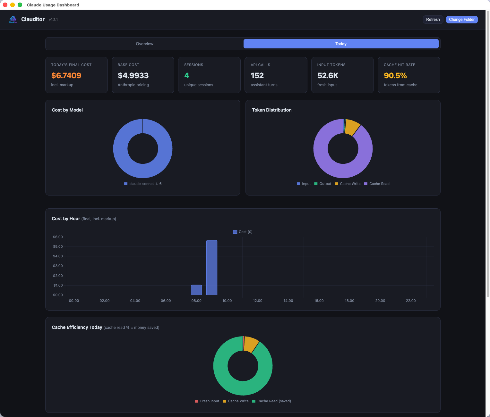

# Clauditor

A single-file HTML dashboard that visualises your Claude Code token usage and costs — entirely in the browser. No server, no data leaves your machine.

### Overview



### Today



## Features

- **Cost tracking**: Anthropic base cost with an optional markup multiplier (default ×1, no markup); the number of decimal places shown for costs is a setting (0 to 8, default 2), as are the thousands and decimal separators
- **Token usage**: an all-time total of every token the logs contain, broken down by type (input, output, 5-minute and 1-hour cache writes, cache reads) with each type's share of the volume next to its share of the bill: cache reads are typically most of the tokens and a fraction of the cost, 1-hour cache writes the reverse
- **Cost over time chart** — single bar per period showing final cost; click any bar to drill into session breakdown
- **Token breakdown chart** — stacked bar showing input, output, cache write (split 5-minute vs 1-hour, since the two are billed at different rates), cache read
- **Model breakdown**: calls, tokens, and cost per model; prices update automatically from Anthropic's official pricing page (daily GitHub workflow), each request is priced at the rate in force when it ran, and models without a price entry trigger a visible warning banner instead of silently using wrong rates
- **Per-model session explorer**: click any model row to expand its sessions: a sortable list (three-state headers: ascending / descending / neutral; default and neutral order is final cost, most expensive first, the rule every table in the app follows) with Material-style pagination (5/10/25/50/100 rows per page, default 5); Type (Chat / Cowork / Code) and Source (Desktop app / CLI) columns say what each session is and where it ran; clicking a session opens a detail modal with stat cards, token distribution, per-model and per-agent breakdowns, and timeline info
- **Cowork task usage** — Cowork tasks ("Tasks" in the Desktop app) never write `~/.claude/projects`; their transcripts live in the app's own store. Click **Add Cowork** and select `~/Library/Application Support/Claude/local-agent-mode-sessions` (press Cmd+Shift+G in the dialog and paste the path) — each task appears as one session, with its Desktop title, typed **Cowork**. Chrome forbids remembering folders under `~/Library`, so this uses a one-shot picker; with an archive folder set, loaded Cowork usage is archived and persists across visits — re-add only to pull in new task activity. (Chats remain invisible: they are server-side only and keep no local usage data)
- **Real session names** — sessions are labeled with the same titles the Claude Desktop sidebar shows (read from the logs' `custom-title` records), falling back to the generated slug or id prefix; titles are archived so they outlive log pruning
- **Project breakdown** — all projects listed by name (folder basename for Code work; each Cowork task is its own project, named by its task title), always all time (the section ignores the date filter), paginated (default 10 per page) with every column sortable (three-state headers, default: highest final cost first); rows expand into the same per-project session explorer as Model Breakdown, sessions open the same detail modal; the treemap above it visualizes the top 20
- **Daily / weekly / monthly** view toggle with custom date range filter — by default no range is applied (all history is shown); a "from" date you set is persisted across sessions, "to" always resets to today; the current (in-progress) period is highlighted in gold across all three charts
- **Local-timezone bucketing** — all days, weeks, and months are computed in your local timezone, so a late-evening session lands on the day you actually worked, regardless of where the logs were recorded
- **Day navigator** — browse any past day in the Today tab using prev/next arrows or a date picker; Next/Today controls disable when already on today's date
- **Expandable subagent breakdown** — sessions that used subagents show a clickable **▶ N agents** badge; expanding it reveals a per-agent table (type, model, calls, output tokens, cost) and a donut chart splitting cost by agent
- **Archive folder** — optionally set a folder where Clauditor writes per-month append-only snapshots (`clauditor-archive-YYYY-MM.jsonl`); historical data survives even if Claude Code prunes old session files; only months within your date filter are read, so performance stays fast as the archive grows
- **Re-authorize** — remembers your folder; prompts re-authorization if browser permission expires
- **Zero setup after build** — the built `Clauditor.html` is one self-contained file: open it in Chrome, pick a folder, done

## Getting Started

**Desktop app (recommended)** — `npm install && npm run electron:build` and install from `dist-electron/`. The app reads `~/.claude/projects` *and* the Cowork store natively: no folder pickers, no permission prompts, everything appears on launch and Refresh re-reads both.

**Browser (single file):**

1. **Build `Clauditor.html`** — run `npm install && npm run build`; the single file appears at `dist/Clauditor.html`
2. Open `Clauditor.html` in Chrome, Arc, Edge, or Safari
3. The start page lists the two data sources — browse the ones you want (click any path shown there to copy it to the clipboard):
   - **Claude Code sessions** (`~/.claude/projects`, Windows `%USERPROFILE%\.claude\projects`) — the main source
   - **Cowork tasks** (`~/Library/Application Support/Claude/local-agent-mode-sessions`, Windows `%APPDATA%\Claude\local-agent-mode-sessions`) — optional; on macOS press `Cmd+Shift+G` in the dialog and paste the path
   > **macOS tip:** The `.claude` folder is hidden by default in Finder. Press `Cmd+Shift+.` to toggle hidden folders visible before selecting it.
4. Each successful browse shows a green status; click **Open Dashboard** when ready
5. The Code folder choice is remembered for next time (Chrome/Edge/Arc only) and re-authorized automatically; the Cowork folder cannot be remembered by the browser (see above) — re-browse it via **Data Sources** to pull in new tasks

## Development

```bash
npm install
npm run dev              # Vite dev server with hot reload
npm run build            # → dist/Clauditor.html (single self-contained file)
npm run check:pricing    # sanity-check the pricing table after editing it
npm run electron:dev     # build + launch the desktop app
npm run electron:build   # build + package a desktop installer (dist-electron/)
```

Source lives in `src/` (ES modules, no framework); `index.html` is an EJS template assembled at build time, so open the app through the dev server or the built file — not the raw source file.

## Browser Compatibility

| Browser | Supported | Notes |
|---------|-----------|-------|
| Chrome  | Yes       | Recommended |
| Arc     | Yes       | Chromium-based |
| Edge    | Yes       | Chromium-based |
| Firefox | No        | File System Access API not supported |
| Safari  | Partial   | Works via file picker; folder not remembered between sessions |

## Performance

Claude Code transcripts grow large (every pasted or captured screenshot is stored inside them as text), and a few months of heavy use easily reaches several gigabytes. Clauditor keeps each file's parsed results in the browser (IndexedDB): after the first load, unchanged files are not read at all, and a session file that only grew is read from where it left off. Measured on 3 GB of logs: about 11 s to load before, 5 s for the first load now, and 0.2 s for every load after that. The cache rebuilds itself when you change timezone, and you can clear it with your browser's site data for Clauditor.

## Cost Calculation

Costs are calculated from token counts using Anthropic's published pricing. No `costUSD` field in the JSONL is used or trusted.

```
base_cost = (input_tokens × input_price)
          + (output_tokens × output_price)
          + (cache_write_5m_tokens × cache_write_5m_price)
          + (cache_write_1h_tokens × cache_write_1h_price)
          + (cache_read_tokens × cache_read_price)
          ÷ 1,000,000

final_cost = base_cost × markup_multiplier
```

### Model Pricing

Rates live in [`src/core/pricing.json`](src/core/pricing.json), which is the single source of truth, and are kept current automatically: the [`update-pricing`](.github/workflows/update-pricing.yml) GitHub workflow runs daily, downloads Anthropic's official [pricing page](https://platform.claude.com/docs/en/about-claude/pricing), and commits `pricing.json` to `main` whenever a price changes or a model appears. Nothing third party is involved. Pull and rebuild (or restart `npm run dev`) to pick up new prices; Settings shows the date of the price list in use.

**Prices over time.** Every model keeps a dated history. When a rate changes, the old rate stays and a new version with a `from` date (UTC) is appended, so each request is priced at the rate that was in force when it ran: a session from March keeps March's price even after a later change. The workflow dates a change on the day it first sees it; since it runs daily that is at most a day late, and you can correct a `from` date by editing `pricing.json` (a price announced in advance can be entered with a future date, too). A newly listed model gets its first-seen date, and its first price also covers any earlier logs.

**Prompt-length tiers.** Some models charge more for long prompts (Claude Haiku 5.5: above 100,000 prompt tokens). A request's prompt length is its input plus cache reads plus cache writes, and each request is priced on its own, exactly as Anthropic bills it.

**Cache rates.** 5-minute writes, 1-hour writes and cache reads are priced separately per model, straight from the official table. Claude Code uses both cache lifetimes and reports the split in `usage.cache_creation.{ephemeral_5m_input_tokens, ephemeral_1h_input_tokens}`; entries archived before that split existed carry only a total and are billed at the 5-minute rate.

**Matching log ids.** Each entry matches a version-anchored pattern, so `claude-opus-4-1` cannot swallow a future `claude-opus-4-10`. Cloud-provider spellings resolve to the same entry: Amazon Bedrock (`anthropic.claude-haiku-4-5-20251001-v1:0`, cross-region `us.`/`eu.`/`global.` prefixes, Messages-API ids such as `anthropic.claude-opus-4-7`, and inference-profile ARNs that contain the model id) and Google Vertex AI (`claude-sonnet-4-5@20250929`).

**Models without an exact entry** are estimated and listed in the warning banner:
- a Claude model whose family is recognisable (`claude-opus-6`, say) is priced like the newest model of that family in `pricing.json`, so the estimate stays current as the list grows;
- any other Claude id, including an opaque Bedrock application-inference-profile ARN, gets default rates ($3/$15);
- a model that is not Anthropic's (a locally-run `gpt-oss:20b`, say) costs nothing and is not flagged.

**Adding a model by hand.** The warning banner has a **How to add** button that opens a guide with a ready-to-paste entry for each unpriced model: the right key derived from its id, prefilled with the rates currently used as the estimate, and shown in place inside `pricing.json`. Ids without a model name get the `aliases` form instead. By hand, it works like this: add an entry to `src/core/pricing.json`. The key is the part of the id that names the model; it matches any id containing it as a whole version, with or without a date, provider prefix or revision suffix:

```json
"acme-2": {
  "name": "Claude Acme 2",
  "history": [
    { "input": 3, "output": 15, "cacheWrite5m": 3.75, "cacheWrite1h": 6, "cacheRead": 0.3 }
  ]
}
```

For an id that does not contain a model name at all, such as a Bedrock application inference profile, add it to the `aliases` of the model it runs, matched exactly (case does not matter):

```json
"sonnet-4-5": {
  "name": "Claude Sonnet 4.5",
  "aliases": ["arn:aws:bedrock:eu-central-1:123456789012:application-inference-profile/abc123"],
  "history": [ ... ]
}
```

Run `npm run check:pricing`, then commit. The workflow never deletes models and never touches `aliases`, so hand-made entries survive its updates.

**Cloud billing.** Prices are Anthropic's first-party list prices. On Bedrock or Vertex AI your bill can differ: regional and multi-region endpoints cost 10% more than global ones, and companies often have negotiated discounts. For a flat difference, set the markup multiplier in Settings (1.1 for regional endpoints, for example).

**Running it by hand.** `npm run update:pricing` performs the same update locally; `npm run check:pricing` validates the list (structure, rate ordering, id resolution, time and tier selection, the page parser). The parser refuses to guess: an unknown column, a cell with more than one price, a model name it can't map, or markup it doesn't recognise makes the workflow fail, GitHub emails you, and `pricing.json` keeps the last good prices. To skip a row on purpose, add its name to `IGNORED_ROWS` in `scripts/update-pricing.mjs`.

**Not modelled yet:** fast mode (premium rates for Opus 5.5, 5 and 4.8) and the 1.1x surcharge for US-only inference. Claude Code records both per request (`usage.speed`, `usage.inference_geo`); requests that use them are priced at standard rates.

The markup multiplier (default `1`, i.e. no markup; set it higher if someone bills you a surcharge on top of Anthropic rates) is editable live in the UI; to change the default, edit `CONFIG_DEFAULT_MARKUP` in `src/core/config.js`.

## Archive (optional)

Claude Code periodically prunes old session logs from `~/.claude/projects`. The **Set Archive** button in the header lets you designate any local folder as a persistent archive. Once set:

- After every load, new entries are appended to per-month files (`clauditor-archive-2026-01.jsonl`, etc.) — files only grow, never rewritten
- On the next load, only months within your **date-from** filter are read, so startup stays fast even after years of data
- Archived entries are merged with whatever live files still exist on disk — nothing is ever duplicated or lost
- Files are plain JSON-lines on disk — portable across browsers, machines, and timezones (days are recomputed from timestamps in the viewer's local timezone); point a different browser at the same folder by clicking **Set Archive** once

The folder preference is stored in IndexedDB (Chrome/Edge/Arc). Safari users can set an archive folder too, but the preference is not remembered between sessions (re-select after each page open).

## Data Source

Claude Code writes session logs to:

```
~/.claude/projects/{project-slug}/{session-uuid}.jsonl
~/.claude/projects/{project-slug}/{session-uuid}/subagents/*.jsonl
~/.claude/projects/{project-slug}/{session-uuid}/subagents/*.meta.json
```

Only `type: "assistant"` entries with a `message.usage` field are parsed. All other entries are ignored. `.meta.json` sidecar files are read to resolve agent type names (e.g. `"product-owner"`, `"frontend-dev"`) for the subagent breakdown.

## Privacy

All processing happens locally in your browser, and the built `Clauditor.html` makes **zero network requests** — every dependency (charts, styles) is bundled into the file. Your JSONL files are never uploaded anywhere.

## Tech Stack

- Vanilla JS (ES modules, no framework), bundled with [Vite](https://vitejs.dev/)
- [ApexCharts](https://apexcharts.com/) — all charts, bundled into the single file
- [Tailwind CSS 4](https://tailwindcss.com/) + [DaisyUI 5](https://daisyui.com/) — styling and components
- `vite-plugin-singlefile` — inlines all JS/CSS into one self-contained HTML file
- File System Access API — `window.showDirectoryPicker()` (Chrome/Edge/Arc); `<input webkitdirectory>` fallback for Safari
- IndexedDB — persists the directory handle and archive folder handle between sessions (Chrome/Edge/Arc only)
- File System Access API writable streams — used for append-only archive writes
- Optional Electron wrapper for a desktop app

## License

MIT
